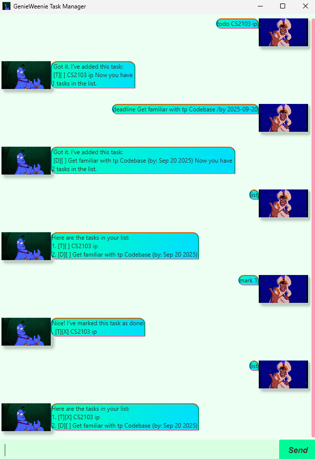

# GenieWeenie User Guide

Welcome to **GenieWeenie**, your personal task management chatbot!

## Features

### 1. Adding Tasks
- **Todo:** `todo <description>`
- **Deadline:** `deadline <description> /by <yyyy-MM-dd>`
- **Event:** `event <description> /from <yyyy-MM-dd HH:mm> /to <yyyy-MM-dd HH:mm>`

### 2. Listing Tasks
- Command: `list`
- Shows all tasks with their status and details.

### 3. Marking / Unmarking Tasks
- **Mark done:** `mark <task number>`
- **Mark not done:** `unmark <task number>`

### 4. Deleting Tasks
- Command: `delete <task number>`

### 5. Finding Tasks
- Command: `find <keyword>`
- Lists all tasks containing the keyword.

### 6. Exiting
- Command: `bye`
- Saves your tasks and exits GenieWeenie.

## Tips
- Ensure date and time are in the correct format: `yyyy-MM-dd HH:mm` for Events and `yyyy-MM-dd` for Deadlines.
- Task numbers correspond to the order shown in the `list` command.
- Use descriptive task names for better searching.

## Screenshot
The above screenshot shows GenieWeenie fully populated with tasks and ready to use.